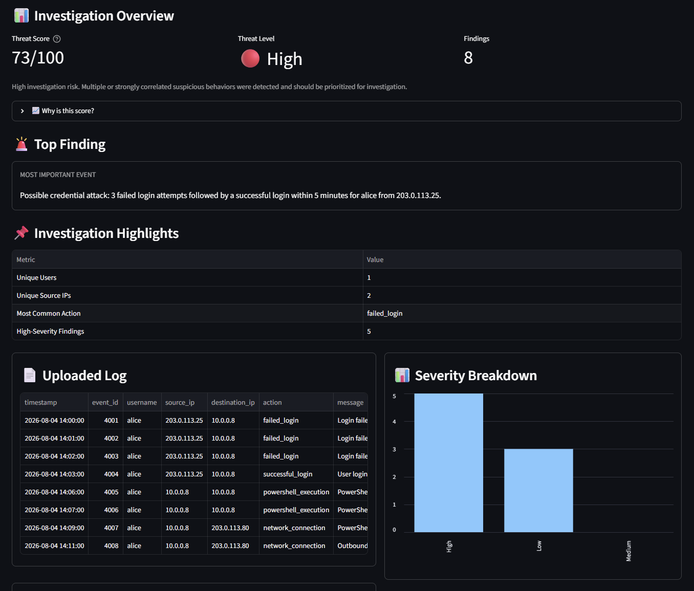
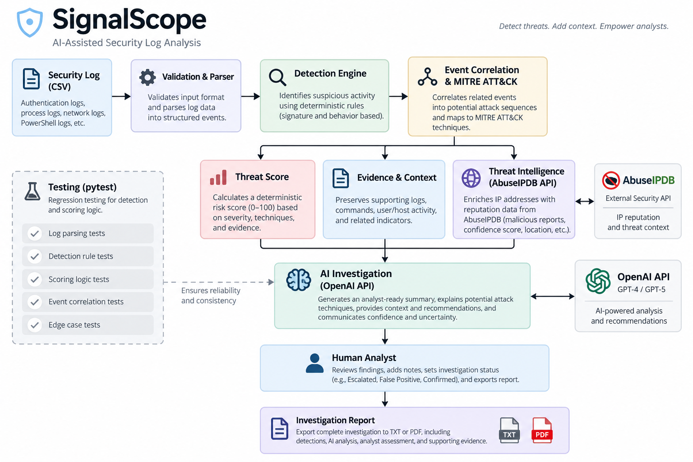
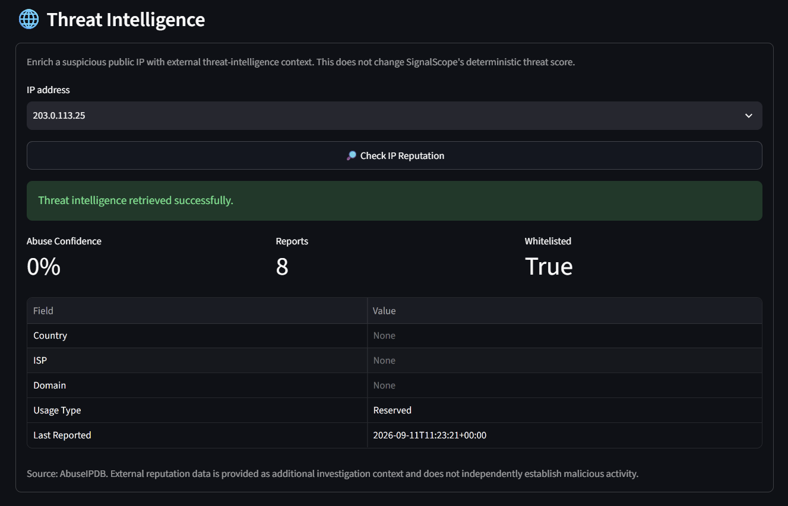
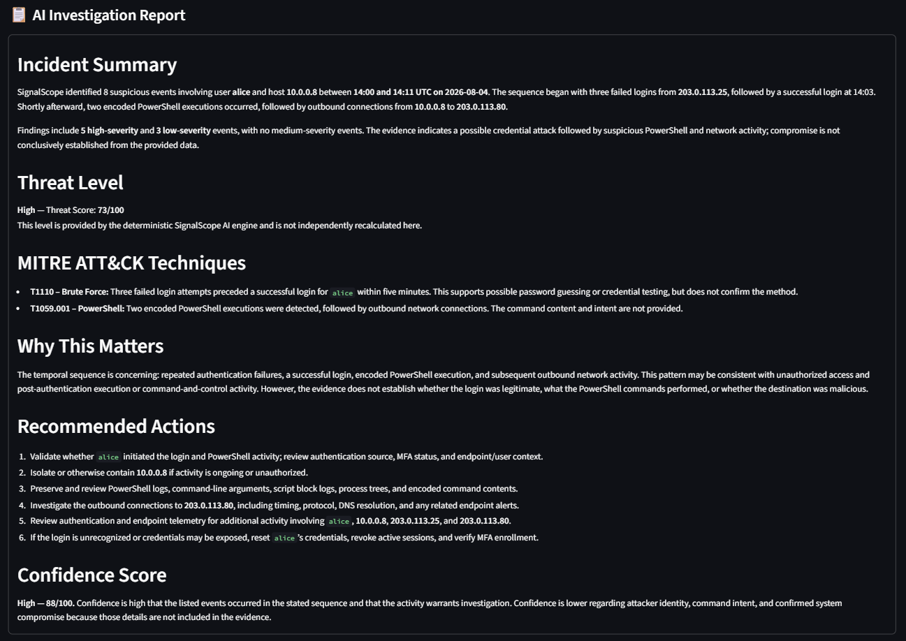
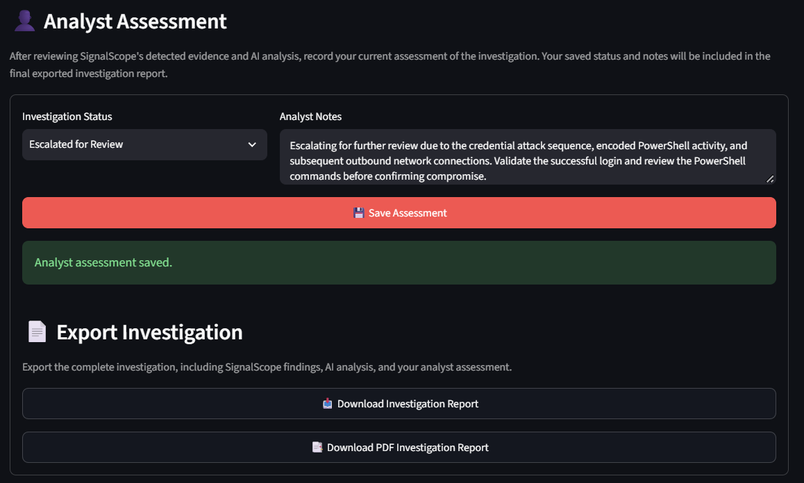

# SignalScope AI

**AI-assisted security investigation platform for detecting suspicious log activity, correlating behavioral signals, and supporting analyst investigations.**

SignalScope combines deterministic security detection with explainable threat scoring, MITRE ATT&CK mapping, external threat intelligence, AI-assisted analysis, and human analyst review.



## Overview

Security events can be difficult to interpret in isolation. SignalScope analyzes events as related behaviors to identify suspicious patterns and provide analysts with a structured investigation workflow.

The platform separates four key responsibilities:

- **Detection & Correlation:** Identifies suspicious behaviors and relationships between events.
- **Threat Scoring:** Calculates a reproducible and explainable investigation-risk score.
- **AI Assistance:** Summarizes evidence, generates analysis, and answers analyst questions.
- **Human Review:** Allows the analyst to record the final investigation status and notes.

External threat intelligence provides additional context without automatically changing the internal SignalScope threat score.

## Key Features

- Behavioral security detection and event correlation
- Credential attack detection
- Encoded PowerShell detection
- PowerShell-to-network correlation
- Privilege escalation detection
- Scheduled-task persistence detection
- Network activity detection
- MITRE ATT&CK technique mapping
- Explainable 0-100 threat scoring
- Evidence filtering and search
- AbuseIPDB IP reputation enrichment
- AI-generated investigation analysis
- Follow-up investigation chat
- Human analyst assessment and notes
- TXT and PDF investigation reports
- Input validation and error handling
- Automated regression testing

## Investigation Workflow



This architecture intentionally keeps deterministic security analysis separate from generative AI. The LLM assists with interpretation and communication but does not determine the investigation's threat score.

## Detection Capabilities

### Credential Attacks
Detects repeated failed authentication attempts followed by a successful login within a defined time window.

### Encoded PowerShell
Identifies PowerShell execution associated with encoded commands.

### PowerShell / Network Correlation
Correlates encoded PowerShell activity with subsequent outbound network connections.

### Privilege Escalation
Detects privilege changes followed by administrative or restricted actions.

### Scheduled Task Persistence
Identifies automatically configured scheduled tasks followed by task execution.

### Network Activity
Identifies outbound network activity and incorporates it into broader behavioral analysis.

## Explainable Threat Scoring

SignalScope calculates an overall investigation-risk score from **0-100** using three components:

1. **Base Evidence** - individual suspicious indicators
2. **Behavioral Correlations** - related event sequences that provide stronger context
3. **Investigation Breadth** - multiple distinct categories of suspicious behavior

| Score | Threat Level |
|---|---|
| 0-29 | Low |
| 30-69 | Medium |
| 70-100 | High |

The score is calculated by SignalScope's deterministic scoring engine rather than the LLM, making the result reproducible and explainable.

Analysts can expand the score breakdown in the dashboard to see exactly which behaviors contributed to the final score.

## Threat Intelligence

SignalScope integrates with **AbuseIPDB** to enrich suspicious public IP addresses with external reputation context.



Available enrichment includes:

- Abuse confidence score
- Report count
- Whitelist status
- Country
- ISP
- Domain
- Usage type
- Last reported activity

Threat-intelligence data is intentionally kept separate from SignalScope's deterministic threat score. External reputation can provide useful context but does not independently establish malicious activity.

## AI-Assisted Investigation

SignalScope uses the OpenAI API to assist analysts after deterministic analysis has already identified the relevant evidence.



The AI layer can:

- Generate an investigation analysis
- Explain suspicious behaviors
- Recommend follow-up investigation steps
- Answer analyst questions
- Maintain investigation conversation context
- Adapt reports for different audiences and levels of detail

The AI does **not** independently calculate or override the SignalScope threat score.

## Human-in-the-Loop Assessment

After reviewing the evidence and AI-assisted analysis, the analyst can record an investigation status such as:

- Investigating
- Likely Benign
- Escalated for Review
- Confirmed Incident

Analyst notes and the selected disposition are incorporated into the final investigation report.

This workflow keeps the human analyst responsible for the final investigation judgment.



## Reporting

SignalScope supports:

- TXT investigation reports
- PDF investigation reports

The PDF report combines:

- Threat score and level
- Incident summary
- Suspicious events
- MITRE ATT&CK mappings
- AI-assisted investigation analysis
- Recommended actions
- Analyst assessment and notes

## Input Validation

Before analysis, SignalScope validates uploaded CSV logs and handles:

- Empty files
- Missing required columns
- Invalid timestamps
- CSV parsing errors

Invalid inputs produce clear user-facing errors rather than being passed into the detection engine.

## Testing

SignalScope includes automated regression tests covering benign behavior, attack scenarios, scoring, and malformed inputs.

Current scenarios include:

- Normal activity
- Normal PowerShell activity
- PowerShell attack activity
- Multi-stage attack behavior
- Normal administrative activity
- Privilege escalation
- Normal scheduled-task activity
- Scheduled-task persistence
- Empty CSV validation
- Missing required-column validation
- Invalid timestamp validation

**Current test result: 12/12 passing**

Run the full test suite with:

```bash
python -m pytest tests -v
```

## Tech Stack

- **Python** - application and detection logic
- **Streamlit** - analyst dashboard
- **pandas** - log processing and analysis
- **OpenAI API** - AI-assisted investigation
- **AbuseIPDB API** - external IP reputation enrichment
- **ReportLab** - PDF investigation reports
- **pytest** - automated testing
- **MITRE ATT&CK** - technique mapping

## Project Structure

```text
SignalScopeAI/
|-- app.py
|-- ai_report.py
|-- requirements.txt
|-- .env.example
|-- .gitignore
|
|-- data/
|   |-- benign scenarios
|   |-- attack scenarios
|   `-- malformed-input scenarios
|
|-- src/
|   |-- detector.py
|   |-- parser.py
|   |-- mitre_map.py
|   `-- utils/
|       |-- investigation.py
|       |-- pdf_report.py
|       |-- prompts.py
|       |-- report_export.py
|       |-- scoring.py
|       |-- session.py
|       `-- threat_intel.py
|
`-- tests/
    |-- test_parser.py
    `-- test_scenarios.py
```

## Getting Started

### 1. Clone the repository

```bash
git clone <repository-url>
cd SignalScopeAI
```

### 2. Create and activate a virtual environment

```bash
python -m venv venv
```

Windows PowerShell:

```powershell
venv\Scripts\Activate.ps1
```

### 3. Install dependencies

```bash
pip install -r requirements.txt
```

### 4. Configure API keys

Copy `.env.example` to `.env` and add your own credentials:

```text
OPENAI_API_KEY=your_openai_api_key_here
ABUSEIPDB_API_KEY=your_abuseipdb_api_key_here
```

Never commit `.env` or expose API credentials publicly.

### 5. Run SignalScope

```bash
python -m streamlit run app.py
```

## Key Design Decisions

**Why deterministic scoring instead of AI-generated scoring?**  
Security scoring should be reproducible and auditable. SignalScope uses explicit scoring rules while the LLM focuses on interpretation and communication.

**Why doesn't AbuseIPDB automatically change the threat score?**  
Third-party reputation data can be incomplete, stale, or misleading without context. SignalScope presents it as supporting evidence for the analyst rather than silently changing the internal assessment.

**Why keep a human analyst in the workflow?**  
Automated detections and AI can support an investigation, but they should not silently determine the final disposition. SignalScope preserves analyst judgment in the final case report.

## Production Considerations

SignalScope is a prototype built to explore security analytics, AI-assisted investigation, and analyst workflows. A production implementation could add persistent case storage, role-based access control, centralized secrets management, audit logging, scalable log ingestion, SIEM/EDR integrations, and enterprise authentication.

## Author

**Riley London**  
B.A. Intelligence and Cyber Operations  
University of Southern California